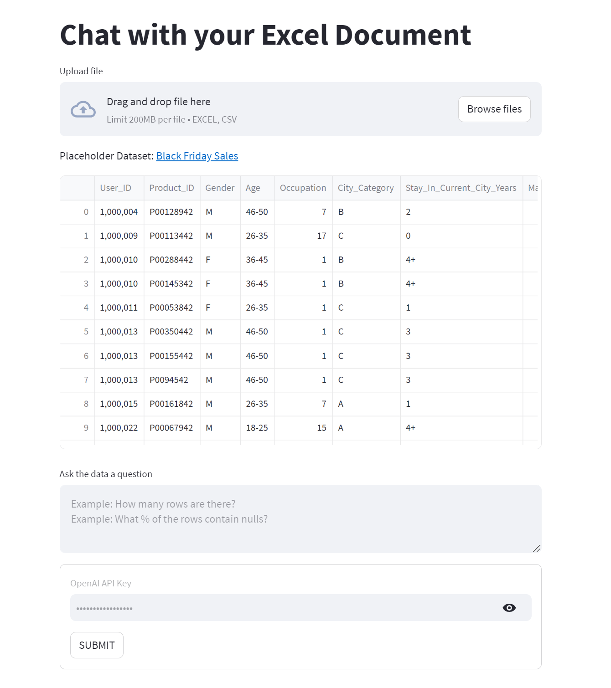

# Chat with an Excel Document

This is a generative AI boilerplate app for chatting with an Excel file. The app was built using LangChain and Streamlit, and invokes OpenAI's API.

### Overview of the App

- Accepts an Excel or CSV file as an upload
- Document is passed into an agent (LangChain's create_csv_agent())
- Q&A is achieved by querying the agent which analyzes the file and responds conversationally



### Get an OpenAI API Key

1. Go to https://platform.openai.com/account/api-keys.
2. Click on the '+ Create new secret key' button.
3. Next, enter an identifier name (optional) and click on the 'Create secret key' button.

## Setup

1. Clone this repo
    ```bash
    $ git clone https://github.com/ccmilne/ExcelDocumentAnalyzer.git
    ```

2. Navigate into the directory
    ```bash
    $ cd ExcelDocumentAnalyzer
    ```

3. Create a new virtual environment
    ```bash
    $ python -m venv venv
    $ . venv/bin/activate
    ```

4. Install the requirements
    ```bash
    $ pip install -r requirements.txt --user
    ```

5. Add your [OPENAI API key](https://platform.openai.com/account/api-keys) to '.streamlit/secrets.toml' file

6. Run the application:
    ```bash
    $ streamlit run app.py #or py -m streamlit run app.y
    ```
